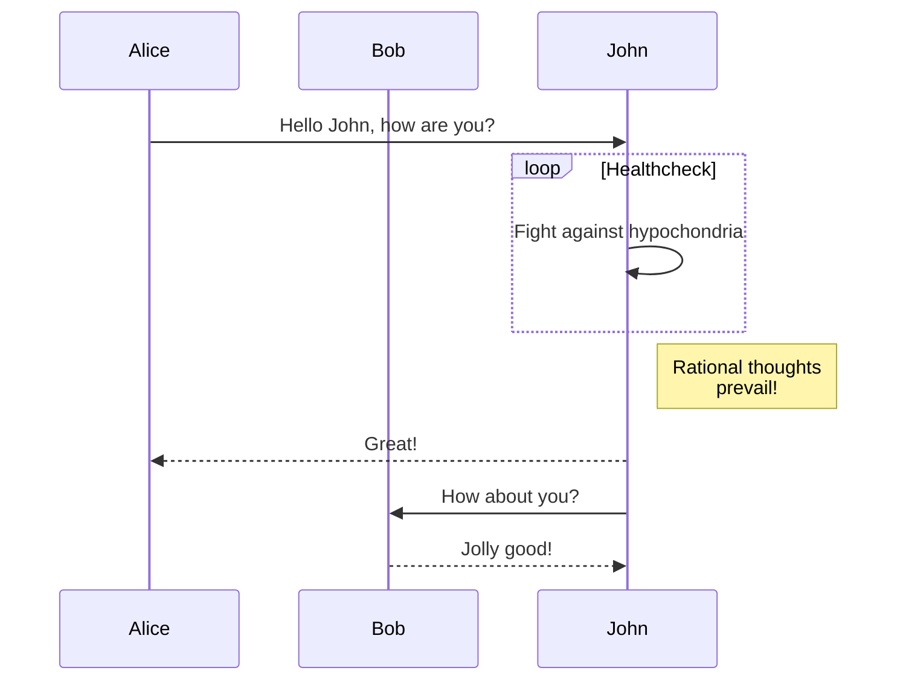

# Diagrams

You can use diagram as code approach right inside your markdown files!

## Mermaid JS

In order to create [mermaid](https://mermaid.js.org/) diagram create code code block with `mermaid` syntax specified.



## PlantUML

In order to create [PlantUML](https://plantuml.com/en/) diagram create code code block with `plantuml` syntax specified.

```plantuml
class Foo1 {
  You can use
  several lines
  ..
  as you want
  and group
  ==
  things together.
  __
  You can have as many groups
  as you want
  --
  End of class
}

class User {
  .. Simple Getter ..
  + getName()
  + getAddress()
  .. Some setter ..
  + setName()
  __ private data __
  int age
  -- encrypted --
  String password
}
```